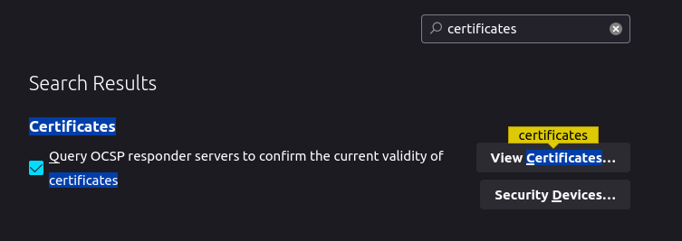
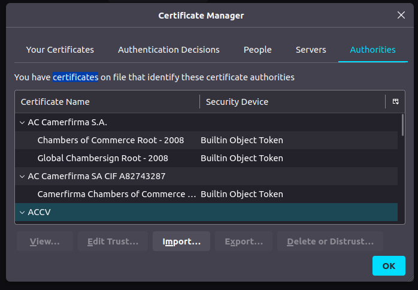
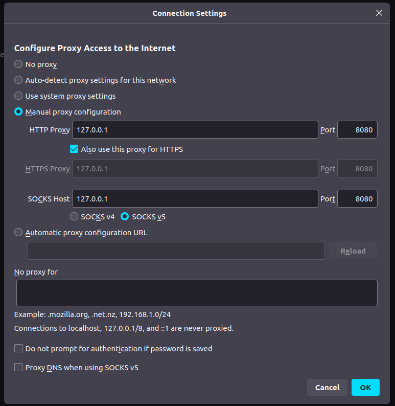

# Configurando o Burp Suite

- Primeiro, precisamos obter o certificado do Burp e inseri-lo em nosso navegador.
- Ao abrir o Burp, iremos para a aba `Proxy` e depois para a seção `Options`:
    
    
    
- Verifique o IP e a porta que estão configurados:
    
    
    
- Esses valores de IP e porta deverão ser inseridos em nosso navegador.
    
    
    
- Em seguida, clique em `CA Certificate` para baixar o certificado.
- Assim que o certificado for baixado, acesse as configurações do navegador.
- Procure por `Certificates` ou `Certificados`
    
    
    
- Clique em `View Certificates` ou `Visualizar Certificados`
- Na nova janela que abrir, procure e clique em `Import` ou `Importar`
    
    
    
- Agora, basta enviar o certificado que acabamos de baixar.
- Se aparecer alguma opção perguntando permissão, conceda todas as permissões.
    - Isso permitirá que tenhamos liberdade para fazer tudo o que precisamos no Burp.

---

- Agora no navegador, procure por `Network Settings` ou `Configurações de rede` e clique em `Settings` ou `Configurações`
    
    
    
- Então vamo configurar manualmente, habilitando a opcão de manual (`Manual proxy configuration`)
- Nela vamos colocar o IP e a porta recebido do burp
    
    
    

---

- Agora basta utilizar a vontade do Burp Suite
